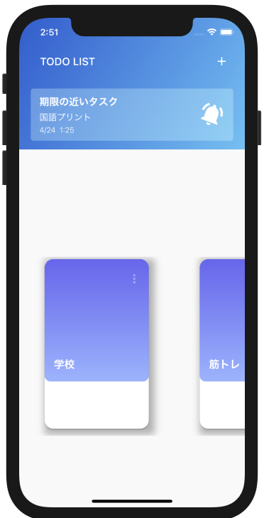
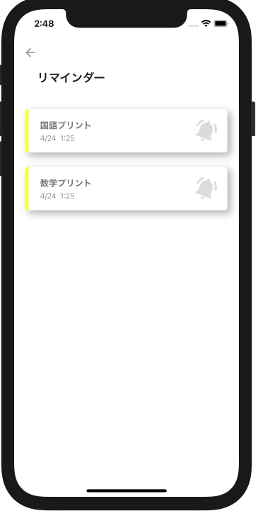
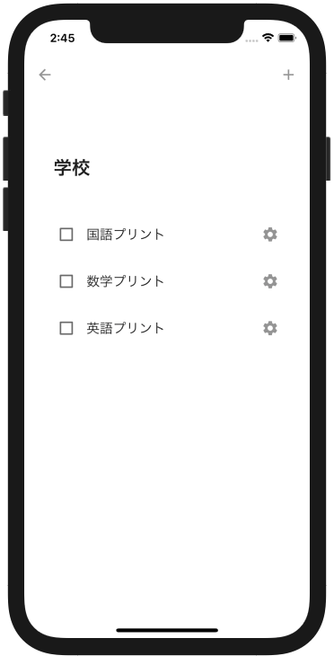
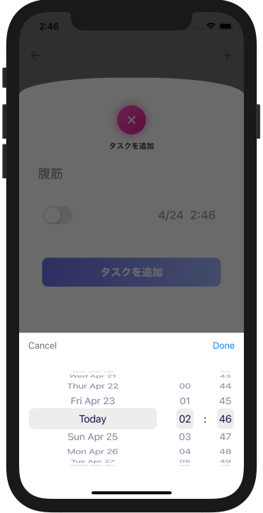
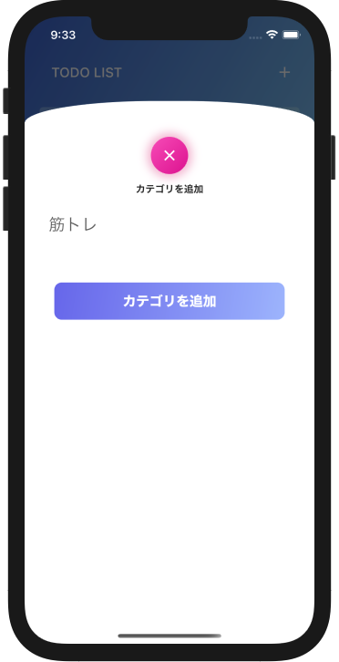

# Simple-TodoApp

## 開発環境

Flutter 2.0.3 • channel stable

## 概要

一通りの機能を備えた、シンプルな Todo リストです。  
現在、実装されている機能は以下のものがあります。

- カテゴリー、タスクの追加/削除
- 指定した時間のリマインダー機能
- 内部の sqflite によるタスクの保存

## デモ

<table>
    <tr>
      <td></td>
      <td></td>
    </tr>
    <tr>
      <td></td>
      <td></td>
    </tr>
    <tr>
      <td></td>
    </tr>
  </table>

## License

MIT
